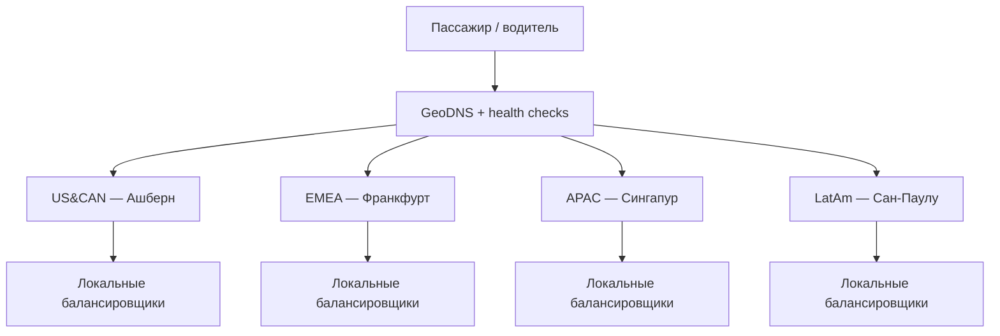
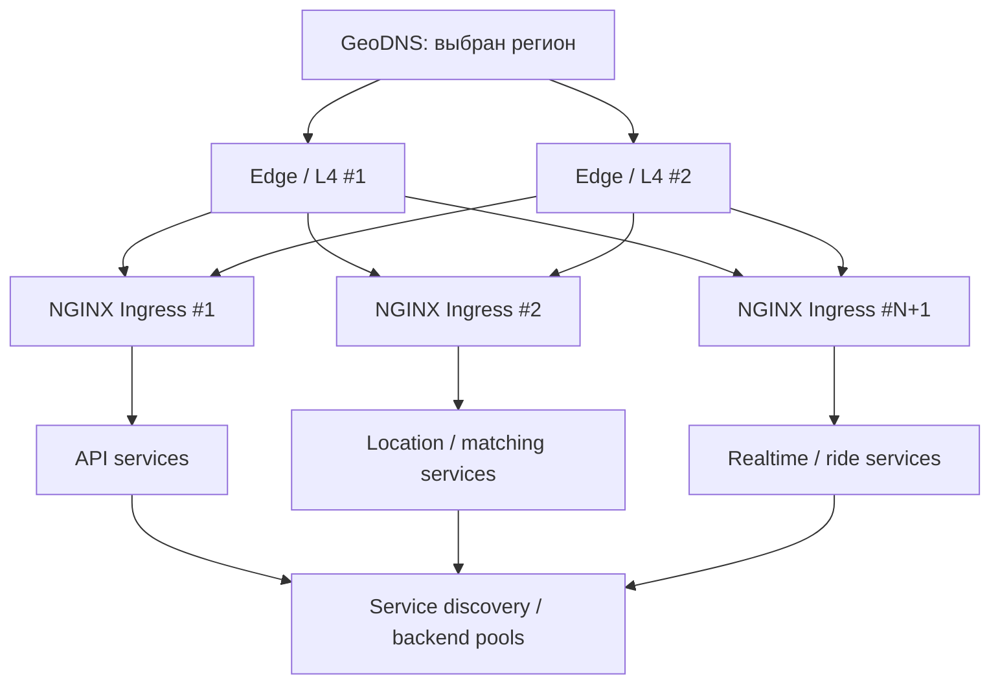

# Расчётно-пояснительная записка для курсовой работы по предмету «Проектирование высоконагруженных систем»

## 1. Тема и целевая аудитория

Тип сервиса: сервис онлайн-заказа такси (аналог Uber)

В рамках проекта рассматривается высоконагруженный сервис, аналогичный Uber, который связывает пассажиров и водителей такси - пассажир задаёт точки отправления и назначения, получает предварительную стоимость и ETA, создаёт заказ, после чего система подбирает подходящего свободного водителя поблизости и сопровождает поездку до завершения.

Так как на данный момент Uber является суперапом по типу Яндекс Go, было принято решение ограничить функционал только частью связанной с заказом такси. 

На рынке есть крупные сервисы, такие как Lyft, DiDi и Bolt за рубежом, и ЯндексGo и Ситимобил в России. Uber работает в 74 странах и более чем в 15 000 городах, что говорит о распределении целевой аудитории по всему миру [2].

### Целевая аудитория

Проектируемый сервис рассчитан на глобальную аудиторию крупных и средних городов.

| Параметр | Значение |
|---|---|
| География | Северная и Южная Америка, Европа, Азия и другие регионы присутствия сервиса |
| Месячная аудитория | около 100 млн пассажиров MAU для сервиса такси (оценка) |
| Целевая группа водителей | около 5 млн водителей MAU (оценка) |
| Основные клиенты | мобильное приложение пассажира и мобильное приложение водителя |
| Масштаб | международный высоконагруженный сервис |

Оценка аудитории такси получена из 208 млн MAPC всей платформы Uber за II квартал 2026 года [1] при допущении, что на поездки приходится примерно половина аудитории. Uber не публикует здесь отдельный MAU только для такси; точность оценки ограничена.

Основные группы пользователей:

1. Пассажиры — заказывают поездку из точки A в точку B.
2. Водители — принимают заказы и выполняют поездки.

### Ключевой функционал MVP

1. Регистрация и авторизация (+ мб верификация пользователя по коду из смс)
2. Формирование поездки - выбрать точки А и Б, класс машины, способ оплаты + доп опции
3. Поиск и назначение водителя.
4. Расчёт итоговой стоимости и оплата - после завершения поездки
5. Рейтинговая система — оценка пассажир-водитель и водитель-пассажир 
6. Отслеживание на карте

### Ключевые продуктовые решения

1. Подбор водителя по геопозиции — заказ предлагается ближайшим свободным водителям.
2. Динамический расчёт стоимости — цена рассчитывается до создания заказа на основе расстояния, времени поездки, выбранного тарифа и текущего спроса.
3. Отслеживание поездки в реальном времени — во время поиска машины и поездки пассажир получает актуальное местоположение автомобиля.
4. Автоматическое завершение и оплата — после окончания поездки система рассчитывает итоговую стоимость и автоматически списывает средства выбранным способом оплаты.
5. Двусторонняя рейтинговая система — после поездки пассажир может оценить водителя, а водитель — пассажира.

`Почему это хайлоад`

Uber сообщил о 3,867 млрд поездок и доставок за II квартал 2026 года, то есть в среднем около 42,5 млн операций в день по всей платформе (учитывая остальные сервисы суперапа Uber) [1]. Кроме пользовательских запросов, также создаются и системные запросы: активные водители постоянно передают координаты, пассажирские приложения обновляют состояние заказа, а система непрерывно выполняет геопоиск и сопоставление водителей и пассажиров.

## 2. Расчёт нагрузки

По отчёту Uber за II квартал 2026 года вся платформа имела 208 млн MAPC и 3,867 млрд завершённых поездок и доставок за 91 день. Отдельного числа поездок и активных пассажиров только для такси в отчёте нет. Для оценки принимаем долю такси 50%: около 100 млн пассажиров в месяц и 20 млн завершённых поездок в день (3,867 млрд / 91 × 50% ≈ 21,25 млн). Из 10 млн водителей и курьеров всей платформы за квартал [3] принимаем 5 млн водителей такси в месяц. Дневную аудиторию принимаем равной 15 млн пассажиров и 2 млн водителей.

Один водитель работает в среднем 8 часов в активный день, период координат — 4 секунды (сопоставимо с описанием Uber [4]), отслеживание заказа пассажиром длится 30 минут с обновлением раз в 10 секунд. Для выбора мощности принимаем пиковую часовую нагрузку в 3 раза выше среднесуточной скорости.

Часть исходных значений в этом разделе является не опубликованной статистикой Uber, а проектными допущениями. Значения 15 млн пассажиров DAU, 2 млн водителей DAU, 8 часов активности водителя, 30 минут отслеживания поездки, интервал отслеживания 10 секунд и коэффициент пика ×3 приняты для расчётной модели. Они нужны для перехода от публичных квартальных показателей Uber к нагрузке на конкретные методы API. После запуска реального сервиса эти коэффициенты должны уточняться по telemetry и фактическому суточному профилю нагрузки.

### Продуктовые метрики

| Метрика | Оценка для MVP такси | Основание |
|---|---:|---|
| Пассажиры, MAU | 100 млн | 50% от 208 млн MAPC всей платформы [1] |
| Пассажиры, DAU | 15 млн | 15% от MAU |
| Водители, MAU | 5 млн | около 50% от 10,2 млн водителей и курьеров [3] |
| Водители, DAU | 2 млн | 40% от MAU водителе |
| Завершённые поездки | 20 млн/сутки | около 50% от 3,867 млрд операций за 91 день [1] |
| Поездки на активного пассажира | 1,33/день | 20 млн / 15 млн DAU |
| Поездки на активного водителя | 10/день | 20 млн / 2 млн DAU |
| Расчёт предварительной цены | 2,67/активного пассажира в день | 2 расчёта на поездку; 40 млн/сутки |
| Создание заказа и оплата | по 1,33/активного пассажира в день | по 1 операции на поездку; по 20 млн/сутки |
| Оценки после поездки | 2/поездку | пассажир оценивает водителя и наоборот; 40 млн/сутки |
| Координаты водителя | 7 200/активного водителя в день | 8 ч × 3600 / 4 с; 14,4 млрд/сутки |
| Обновление состояния поездки пассажиру | 180/поездку | 30 мин × 60 / 10 с; 3,6 млрд/сутки |

В таблице RPS ниже дополнительно используется допущение, что до принятия заказа он в среднем предлагается двум водителям. Поэтому на 20 млн поездок приходится около 40 млн событий предложения заказа водителю в сутки. Размеры сетевых сообщений и записей в хранилище также являются проектной оценкой структуры данных, а не опубликованными внутренними форматами Uber.

**Средний объём данных на пользователя.** При хранении истории поездок год средний пассажир совершает 73 поездки (20 млн × 365 / 100 млн). На него приходится один профиль (1 КБ), 73 записи поездок (по 2 КБ), 73 платежа (по 0,5 КБ) и 73 оставленные оценки (по 0,2 КБ): всего около **198 КБ = 0,000198 ГБ**. 
Средний водитель выполняет 1 460 поездок за год (20 млн × 365 / 5 млн); его профиль и связанные записи поездок и оценок занимают примерно **3,2 МБ = 0,0032 ГБ** без дублирования поездок в общем хранилище. Геопозиции учитываются отдельно: на одного из 5 млн месячных водителей в среднем приходится 86 400 точек за 30 дней, или **0,00415 ГБ** при 48 байтах на точку. Эти оценки не включают карты и медиафайлы: их хранение не входит в MVP.

### Технические метрики

#### Хранение

| Тип данных | Срок хранения в модели | Количество записей | Размер записи | Полезный объём |
|---|---:|---:|---:|---:|
| Профили пассажиров и водителей | всё время работы сервиса | 105 млн | 1 КБ | 0,105 ТБ |
| Завершённые поездки и маршрут/стоимость | 1 год | 7,3 млрд | 2 КБ | 14,6 ТБ |
| Платёжные операции (без данных банковских карт) | 1 год | 7,3 млрд | 0,5 КБ | 3,65 ТБ |
| Оценки пассажиров и водителей | 1 год | 14,6 млрд | 0,2 КБ | 2,92 ТБ |
| История координат водителей | 30 дней | 432 млрд | 48 Б | 20,736 ТБ |
| **Итого полезных данных** | | | | **≈42,0 ТБ** |

Количество точек геопозиции: 2 млн активных водителей × 8 ч × 3600 / 4 с × 30 дней = 432 млрд. Для планирования физического хранилища при трёх копиях без учёта индексов и резервных копий требуется около **126 ТБ**.

#### Сетевой трафик

Указан прикладной трафик между мобильными клиентами и сервисом; средняя скорость = Гбайт/сутки × 8 / 86 400, пиковая = средняя × 3. Гигабайты и терабайты здесь десятичные. Загрузка карт из внешнего картографического сервиса не включена.

| Тип трафика | Расчёт | Гбайт/сутки | Пик, Гбит/с |
|---|---|---:|---:|
| Координаты водителей → сервер | 14,4 млрд сообщений × 200 Б | 2 880 | 0,80 |
| Состояние и местоположение машины → пассажир | 3,6 млрд ответов × 500 Б | 1 800 | 0,50 |
| Цена, заказ, назначение, оплата, оценки, авторизация | около 175 млн операций × в среднем 1 КБ | 175 | 0,049 |
| **Итого** | | **4 855** | **≈1,35** |

Для внешних сетевых интерфейсов нужен запас сверх 1,35 Гбит/с на TLS, HTTP, повторы, неравномерность по регионам и служебный обмен. Это глобальная сумма; региональная ёмкость зависит от распределения поездок по времени и географии.

#### RPS по основным методам

Средний RPS = число операций за сутки / 86 400; пиковый RPS = средний × 3. Выдача предложения водителю учитывается как событие сервера, остальные строки — запросы мобильного клиента или внутреннего сервиса. Округление сделано до целых запросов в секунду.

| Метод / событие | Операций в сутки | Средний RPS | Пиковый RPS |
|---|---:|---:|---:|
| `POST /fare-estimates` — предварительная цена | 40 млн | 463 | 1 389 |
| `POST /rides` — создание заказа | 20 млн | 231 | 694 |
| Предложение заказа водителю | 40 млн | 463 | 1 389 |
| `POST /drivers/location` — координаты | 14,4 млрд | 166 667 | 500 000 |
| `GET /rides/{id}/status` — отслеживание | 3,6 млрд | 41 667 | 125 000 |
| `POST /rides/{id}/complete` — завершение и оплата | 20 млн | 231 | 694 |
| `POST /ratings` — две оценки за поездку | 40 млн | 463 | 1 389 |
| `POST /auth/refresh` — один запрос на активного пассажира | 15 млн | 174 | 521 |
| **Итого** | **≈18,175 млрд** | **≈210 359** | **≈631 076** |

Расчёт платежа здесь означает запрос к собственному сервису; обращения к платёжному провайдеру могут иметь другой профиль нагрузки. Пик, усреднённый по всей глобальной системе, не означает одновременный пик во всех регионах.

## 3. Глобальная балансировка нагрузки

Для глобальной системы заказа такси критична задержка между мобильным клиентом и сервером: водитель постоянно передаёт координаты, пассажир получает обновления поездки, а подбор водителя должен работать в пределах того же географического региона. Поэтому трафик сначала направляется в ближайший работоспособный региональный дата-центр, после чего локальные балансировщики распределяют его между экземплярами сервисов.

Uber публично описывает инфраструктуру с edge-прокси, которые завершают TLS/QUIC ближе к пользователю и передают HTTPS-трафик в ближайший дата-центр [7]. В более позднем описании compute-платформы Uber также указывает, что дата-центры работают в active-active режиме и при региональном сбое трафик может быть перенаправлен в другой регион [6]. В проекте используется тот же общий принцип, но конкретные города и веса являются проектным решением.

### 3.1. Функциональное разбиение по доменам

| Домен | Назначение | Основной трафик из раздела 2 | Способ глобальной балансировки |
|---|---|---|---|
| `api.uber-clone.com` | Авторизация, предварительная цена, создание и завершение поездки, оценки | `fare-estimates`, `rides`, `complete`, `ratings`, `auth` | GeoDNS / latency-based DNS |
| `driver.uber-clone.com` | Передача координат водителей и получение предложений заказов | `drivers/location`, события назначения | GeoDNS / latency-based DNS с закреплением водителя за регионом |
| `realtime.uber-clone.com` | Получение пассажиром состояния поездки и положения автомобиля | `rides/{id}/status` | GeoDNS / latency-based DNS с региональной привязкой поездки |

Разделение доменов позволяет независимо масштабировать самый тяжёлый поток координат водителей, обычный HTTP API и realtime-трафик пассажиров. Все три домена в нормальном режиме направляют одного пользователя в один и тот же регион, чтобы состояние активной поездки не приходилось синхронно передавать между удалёнными дата-центрами.

### 3.2. Размещение дата-центров

Точное распределение RPS Uber по регионам публично не раскрывается. Для расчётной модели используется опубликованное Uber распределение выручки за II квартал 2026 года по месту совершения транзакции [5] как proxy географического распределения нагрузки:

- US&CAN — 7,609 млрд долларов из 14,191 млрд, или **53,6%**;
- EMEA — 3,752 млрд долларов, или **26,4%**;
- APAC — 1,808 млрд долларов, или **12,7%**;
- LatAm — 1,022 млрд долларов, или **7,2%**.

Выручка не равна числу запросов: средняя стоимость поездки различается между странами. Поэтому эти доли используются только как начальные веса для архитектурной модели. В работающей системе веса должны корректироваться по фактическим поездкам, RPS, задержке и загрузке инфраструктуры.

В проектируемой системе принимаются четыре активных региональных дата-центра:

| Регион | Расположение проектного ДЦ | Доля нагрузки | Обоснование |
|---|---|---:|---|
| US&CAN | Ашберн, США | 53,6% | Крупнейшая доля нагрузки; удобное расположение для восточной части Северной Америки и развитая сетевая инфраструктура |
| EMEA | Франкфурт, Германия | 26,4% | Центральное положение относительно европейской аудитории и хорошая связность с другими странами EMEA |
| APAC | Сингапур | 12,7% | Крупный сетевой узел для Южной и Юго-Восточной Азии |
| LatAm | Сан-Паулу, Бразилия | 7,2% | Снижение RTT для крупной аудитории Южной Америки |

Эти города выбраны для проектируемой системы и не являются утверждением о фактическом расположении дата-центров Uber.

### 3.3. Распределение запросов по дата-центрам

Региональная пиковая нагрузка рассчитывается по формуле:

`RPS региона = глобальный пиковый RPS × доля региона`

Глобальный пик из раздела 2 равен **≈631 076 RPS**, а глобальный прикладной сетевой трафик — **≈1,35 Гбит/с**.

| Регион | Доля | Пиковый RPS | Пиковый прикладной трафик |
|---|---:|---:|---:|
| US&CAN | 53,6% | ≈338 373 | ≈0,724 Гбит/с |
| EMEA | 26,4% | ≈166 852 | ≈0,357 Гбит/с |
| APAC | 12,7% | ≈80 402 | ≈0,172 Гбит/с |
| LatAm | 7,2% | ≈45 449 | ≈0,097 Гбит/с |
| **Итого** | **100%** | **≈631 076** | **≈1,35 Гбит/с** |

Распределение пикового RPS из раздела 2 по типам запросов:

| Метод / событие | US&CAN | EMEA | APAC | LatAm |
|---|---:|---:|---:|---:|
| `POST /fare-estimates` | 745 | 367 | 177 | 100 |
| `POST /rides` | 372 | 183 | 88 | 50 |
| Предложение заказа водителю | 745 | 367 | 177 | 100 |
| `POST /drivers/location` | 268 092 | 132 196 | 63 702 | 36 009 |
| `GET /rides/{id}/status` | 67 023 | 33 049 | 15 926 | 9 002 |
| `POST /rides/{id}/complete` | 372 | 183 | 88 | 50 |
| `POST /ratings` | 745 | 367 | 177 | 100 |
| `POST /auth/refresh` | 279 | 138 | 66 | 38 |
| **Итого** | **≈338 373** | **≈166 852** | **≈80 402** | **≈45 449** |

Из таблицы видно, что глобальную архитектуру определяет прежде всего поток координат водителей: около 79% пикового RPS приходится на `POST /drivers/location`.

### 3.4. DNS-балансировка

Для `api`, `driver` и `realtime` используется GeoDNS / latency-based DNS с health-check каждого регионального входа. DNS возвращает адрес работоспособного региона с минимальной сетевой задержкой среди регионов, разрешённых для пользователя.

Для DNS-записей принимается TTL **60 секунд** как проектное допущение: этого достаточно для сравнительно быстрого переключения новых соединений и при этом не требуется выполнять DNS-запрос на каждое обращение к API.

Активная поездка получает `home_region` при создании. Пассажир и назначенный водитель обслуживаются тем же регионом до завершения поездки. Такая region affinity уменьшает межрегиональный обмен realtime-состоянием и упрощает соблюдение порядка событий поездки.

### 3.5. Anycast

Для прикладных доменов MVP отдельная Anycast-балансировка не используется. Основной трафик состоит из API-запросов и последовательных обновлений состояния активной поездки, для которых важна стабильная региональная привязка. Глобальное направление клиента выполняется через DNS, а внутри выбранного региона — локальными балансировщиками.

Anycast может использоваться инфраструктурным DNS-провайдером или будущим edge-слоем, однако это не является обязательной частью рассматриваемого MVP.

### 3.6. Регулирование трафика между дата-центрами

Для глобального управления трафиком используются следующие механизмы:

1. Каждый регион периодически публикует состояние: доступность, текущий RPS, использование CPU и сетевых интерфейсов, error rate и задержки.
2. GeoDNS исключает недоступный регион и уменьшает вес перегруженного региона для новых сессий.
3. Новые пользователи направляются в ближайший работоспособный регион с достаточной свободной ёмкостью.
4. Активная поездка закреплена за `home_region`; обычная перебалансировка не переносит её между регионами.
5. При полном отказе региона новые запросы направляются в следующий ближайший доступный дата-центр. Клиентское приложение повторяет запрос через резервный домен после проверки доступности. Подобный механизм primary/backup domains и canary health-check описан Uber для мобильной edge-инфраструктуры [7].
6. После восстановления региона вес возвращается постепенно, чтобы не создать мгновенный скачок нагрузки.
7. Для критичных операций создания/завершения поездки используются idempotency keys, поэтому повтор запроса после сетевого failover не должен создавать дублирующую поездку или повторное списание.

Uber отдельно отмечает, что при региональном failover выжившему региону требуется свободная вычислительная ёмкость для дополнительного трафика [6]. В этом разделе рассчитано нормальное распределение нагрузки; аварийная межрегиональная ёмкость должна резервироваться дополнительно и уточняться на этапе списка серверов.

## 4. Локальная балансировка нагрузки

Внутри каждого регионального дата-центра трафик проходит два уровня балансировки:

1. **L4 / сетевой уровень** — два независимых edge-узла принимают входящий трафик на виртуальный IP. Для этого уровня используется резервирование **N×2**: каждый сетевой узел должен быть способен принять весь входящий трафик дата-центра при отказе второго.
2. **L7 / прикладной уровень** — пул NGINX Ingress Controller завершает TLS и распределяет HTTP-запросы по экземплярам backend-сервисов. Для него используется резервирование **N+1**.

NGINX выполняет TLS termination и L7 routing. Backend-сервисы проектируются stateless относительно HTTP-соединения, поэтому специальная sticky-session балансировка им не требуется; состояние поездки хранится в соответствующих хранилищах. Для долгоживущего realtime-соединения один установленный connection естественно остаётся на выбранном экземпляре до переподключения.

### 4.1. Производительность одного L7-балансировщика

В методических материалах приведён benchmark NGINX Ingress Controller [8]. Для HTTPS на 16 CPU в тесте получено:

- **341 232 HTTPS RPS**;
- **56 715 SSL/TLS transactions per second**;
- **8,80 Гбит/с** throughput.

Benchmark является лабораторным и не учитывает всю production-логику. Поэтому в проекте балансировщик не загружается более чем на 70% от измеренного значения, то есть оставляется 30% запаса:

- допустимый RPS одного ingress: `341 232 × 0,7 ≈ 238 862 RPS`;
- допустимый TLS TPS: `56 715 × 0,7 ≈ 39 701 TPS`;
- допустимый сетевой трафик: `8,8 × 0,7 ≈ 6,16 Гбит/с`.

### 4.2. Расчёт по RPS

Число рабочих L7-балансировщиков:

`N = ceil(пиковый RPS дата-центра / 238 862)`

С учётом схемы N+1:

`N_total = N + 1`

| Региональный ДЦ | Пиковый RPS | Рабочих NGINX `N` | С резервом `N+1` |
|---|---:|---:|---:|
| US&CAN | 338 373 | 2 | **3** |
| EMEA | 166 852 | 1 | **2** |
| APAC | 80 402 | 1 | **2** |
| LatAm | 45 449 | 1 | **2** |
| **Всего** | **631 076** | **5** | **9 NGINX ingress** |

Проверка самого нагруженного региона после отказа одного ingress:

`338 373 / 2 ≈ 169 187 RPS < 238 862 RPS`

То есть три ingress-узла в US&CAN действительно удовлетворяют схеме N+1: при отказе одного оставшиеся два принимают региональный пик.

Для остальных регионов после отказа одного из двух ingress весь региональный пик остаётся ниже допустимых 238 862 RPS одного узла.

### 4.3. Проверка SSL/TLS termination

Точный показатель новых TLS-соединений Uber не раскрывается. Для расчётной модели принимается до **10 новых защищённых соединений на одного активного клиента в сутки**. Это учитывает повторные открытия приложения и переподключения мобильной сети, при этом HTTP/2/QUIC позволяют выполнять много запросов внутри одного соединения.

Активная аудитория: `15 млн пассажиров + 2 млн водителей = 17 млн DAU`.

Количество новых соединений:

`17 млн × 10 = 170 млн соединений/сутки`

Среднее:

`170 млн / 86 400 ≈ 1 968 TLS TPS`

Пик при коэффициенте ×3:

`1 968 × 3 ≈ 5 903 TLS TPS`

Для крупнейшего региона US&CAN:

`5 903 × 53,6% ≈ 3 165 TLS TPS`

Даже один NGINX с проектным ограничением **39 701 TLS TPS** имеет большой запас. Следовательно, SSL termination не определяет количество балансировщиков; ограничителем остаётся RPS.

### 4.4. Проверка пропускной способности сети

Глобальный прикладной пик из раздела 2 составляет около **1,35 Гбит/с**.

Максимум приходится на US&CAN:

`1,35 × 53,6% ≈ 0,724 Гбит/с`

Допустимая нагрузка одного ingress после 30% запаса составляет **6,16 Гбит/с**:

`0,724 Гбит/с < 6,16 Гбит/с`

Даже один ingress перекрывает расчётную сетевую нагрузку региона. Поэтому сеть также не является ограничителем количества L7-балансировщиков.

При реальном развёртывании интерфейсы и uplink должны иметь дополнительный запас на TCP/QUIC, TLS, служебный межсервисный трафик, репликацию и неучтённые повторы; здесь сравнивается именно прикладной внешний трафик из раздела 2.

### 4.5. Итог локальной балансировки

Для одного регионального дата-центра схема выглядит так:

`GeoDNS → 2× Edge/L4 → NGINX Ingress pool (N+1) → backend services`

Количество:

| Компонент балансировки | US&CAN | EMEA | APAC | LatAm | Итого |
|---|---:|---:|---:|---:|---:|
| Edge/L4, резервирование N×2 | 2 | 2 | 2 | 2 | **8** |
| NGINX Ingress, резервирование N+1 | 3 | 2 | 2 | 2 | **9** |

Таким образом, для нормального пикового режима необходимо **9 L7 NGINX ingress-узлов** по всем четырём регионам. Расчёт по RPS является определяющим; SSL TPS и пропускная способность сети имеют существенный запас.

## Источники

1. Uber Technologies, Inc. Uber Announces Results for Second Quarter 2026. 05.08.2026. https://investor.uber.com/news-events/news/press-release-details/2026/Uber-Announces-Results-for-Second-Quarter-2026/default.aspx
2. Uber. Uber’s technology offerings — глобальная доступность более чем в 70 странах и 15 000 городах. https://www.uber.com/gb/en/about/uber-offerings/
3. Uber Technologies, Inc. Q2 2026 Prepared Remarks. 05.08.2026. https://investor.uber.com/files/doc_earnings/2026/q2/transcript/Uber-Q2-26-Prepared-Remarks.pdf
4. Uber Engineering. Scaling Real-Time Traffic Forecasting with a Graph-Aware Transformer. https://www.uber.com/us/en/blog/scaling-real-time-traffic/

5. Uber Technologies, Inc. Form 10-Q for the quarter ended June 30, 2026 — revenue by geographical region. https://www.sec.gov/Archives/edgar/data/1543151/000154315126000032/uber-20260630.htm
6. Uber Engineering. From One Horizontal Scaling Controller to Many: Evolving Uber's Compute Platform. 2026. https://www.uber.com/gb/en/blog/evolving-ubers-compute-platform/
7. Uber Engineering. Engineering Failover Handling in Uber’s Mobile Networking Infrastructure. 14.07.2020. https://www.uber.com/us/en/blog/eng-failover-handling/
8. NGINX. Testing the Performance of NGINX Ingress Controller for Kubernetes. 11.04.2019. https://blog.nginx.org/blog/testing-performance-nginx-ingress-controller-kubernetes